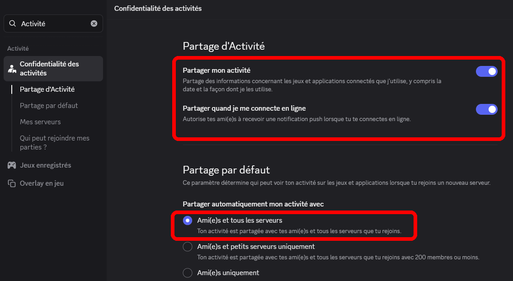

# ❓ Foire Aux Questions

<!-- 
Cette page peut être obsolète. Veuillez consulter la [version anglaise de cette page](https://docs.customrp.xyz/faq) pour obtenir les informations les plus récentes.
 -->

## Questions

### Pourquoi mes boutons ne s'affichent-ils pas ?

C'est un bug dans Discord. Vous ne pouvez pas voir vos propres boutons, mais les autres les verront.

### Est-ce un virus ? Mon antivirus/VirusTotal/etc dit qu'il y a un virus.

Non. CustomRP ne contient aucun virus, le code source est disponible pour tout le monde.

Vous vous demandez peut-être pourquoi certains antivirus et VirusTotal signalent un virus ? C'est principalement parce que mon application n'est pas assez populaire pour être considérée comme fiable par Windows et certains antivirus, et n'est pas signée avec un certificat de signature de code (comme je suis russe, je ne peux actuellement même pas en acheter un, et si je le pouvais, ils sont assez chers...)

### Puis-je ajouter plus de 2 boutons ?

Non, c'est une limitation de Discord.

### Puis-je utiliser un type d'activité Streaming ?

Non, c'est également une limitation de Discord.

### Pourquoi si je définis une date dans quelques jours, Discord n'affiche-t-il que le nombre d'heures restantes ?

Vous l'avez deviné, c'est aussi une limitation de Discord.

### Y aura-t-il une version Linux/Mac ?

L'application est construite avec une bibliothèque Windows uniquement, donc supporter Linux et Mac signifierait réécrire l'application entière dans une bibliothèque/langage de programmation différent, ce que je ne prévois pas pour l'instant.

### Une fenêtre appelée « Pipe » s'est ouverte pour une raison quelconque, qu'est-ce que c'est ?

Elle s'est ouverte parce que vous avez appuyé sur Ctrl+Shift et cliqué sur le bouton Connexion (ou Ctrl et le bouton Connexion, ou Reconnexion dans le menu de l'icône de la barre des tâches sur les anciennes versions). Laissez-la à -1 et fermez-la. Elle est utilisée lorsque vous avez plusieurs clients Discord ouverts en même temps. Changer le numéro de pipe permet de choisir sur quel client votre présence doit apparaître.

## Dépannage

Avant d'essayer quoi que ce soit, assurez-vous que vous utilisez la dernière version de CustomRP !

### J'ai installé CustomRP mais il ne démarre pas.

C'est très probablement votre antivirus qui empêche l'application de se lancer. Ajoutez le dossier `%appdata%\CustomRP` aux exceptions.

### J'ai installé CustomRP, autorisé l'analyse et l'application ne fonctionne plus.

Fermez l'application dans le Gestionnaire des tâches, supprimez le dossier `%localappdata%\maximmax42`, redémarrez l'application et n'autorisez pas l'analyse.

### L'application s'est connectée, mais je ne vois pas le statut dans mon profil.

Assurez-vous d'avoir activé le partage de votre activité dans les paramètres Discord :

<figure><figcaption></figcaption></figure>

Si le partage avec les serveurs a été désactivé, n'oubliez pas de choisir les serveurs sur lesquels vous souhaitez partager votre activité dans la sous-catégorie « Mes serveurs ».

### L'application fonctionnait, mais maintenant elle se connecte indéfiniment.

Vous avez peut-être reçu un délai d'attente de Discord parce que vous vous connectez/changez de présence beaucoup. Déconnectez-vous, attendez 5-10 minutes, essayez de vous reconnecter. Redémarrer Discord pourrait également aider.

### L'application dit « Mauvais ID ? » / « Discord est-il en cours d'exécution ? » ou se connecte indéfiniment bien que je sois sûr d'avoir tout fait correctement et que Discord soit en cours d'exécution.

Voici quelques choses que vous pouvez essayer :

* **Assurez-vous que vous exécutez l'application Discord (pas dans le navigateur).**
* Redémarrez votre PC. Conseil : redémarrer le PC résout beaucoup de problèmes.
* Si vous avez BetterDiscord/Vencord/etc installé, désinstallez-le, laissez CustomRP se connecter à Discord au moins une fois, puis réinstallez-le.
* Si vous utilisez plusieurs clients Discord, quittez temporairement tous sauf celui sur lequel vous souhaitez que la présence apparaisse.
* Exécutez CustomRP en tant qu'administrateur.
* Ajoutez le dossier `%appdata%\CustomRP` ou, dans le cas où vous utilisez une version portable, le dossier dans lequel vous avez extrait CustomRP, aux exceptions du pare-feu et/ou de l'antivirus, puis redémarrez complètement votre PC.
  * Si vous ne savez pas si vous avez un antivirus ou non, vous en avez très probablement un - Windows Defender est sur tous les ordinateurs Windows 10/11.
* Réinstallez Discord.

Si rien n'a aidé, je ne peux rien suggérer d'autre, désolé...

### L'application dit « L'URL d'image est trop longue » ou l'application est bloquée sur « Mise à jour de la présence... »

Vérifiez les URL des images, elles sont soit trop longues, soit n'ont pas réellement de liens directs.

### L'application fonctionnait auparavant, mais ensuite elle s'est plantée et maintenant elle ne se lance pas du tout.

Peut-être avez-vous inséré une longue chaîne de texte fantaisiste (ou du texte dans une langue utilisant des caractères non-latins) dans un champ qui a fait planter l'application. Pour corriger cela, appuyez sur Win+R, tapez `%localappdata%\maximmax42` et supprimez ou renommez les dossiers contenant CustomRP, puis démarrez l'application. Notez que cela réinitialise complètement l'application.

### L'application continue de planter lors de la mise à jour/tentative de connexion/etc.

Si vous pouvez lancer l'application et obtenir un rapport de plantage, et qu'il dit `System.IO.FileNotFoundException: Could not load file or assembly...`, veuillez réinstaller l'application.

**Si vous ne trouvez pas de réponse à votre question/problème, envoyez un message à un canal `#support` sur [le serveur Discord CustomRP](https://www.customrp.xyz/discordserver), envoyez un message à maximmax42 sur Discord ou [ouvrez une issue](https://github.com/maximmax42/Discord-CustomRP/issues/new/choose)**.
