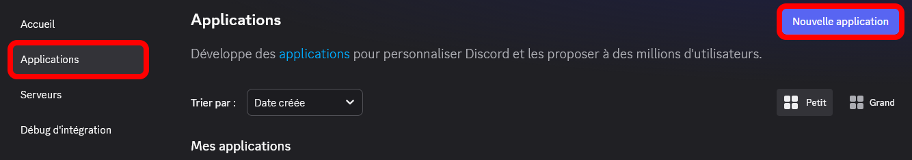

# 🛠️ Configuration

<!-- 
Cette page peut être obsolète. Veuillez consulter la [version anglaise de cette page](https://docs.customrp.xyz/setting-up) pour obtenir les informations les plus récentes.
 -->

Si vous rencontrez des erreurs, consultez la page [FAQ](faq.md).

Avant de configurer, assurez-vous d'avoir l'application Discord (**pas dans le navigateur**) et d'avoir activé le partage de votre activité dans les paramètres:

<figure><figcaption></figcaption></figure>

Si le partage avec les serveurs est désactivé, n'oubliez pas de choisir les serveurs avec lesquels vous souhaitez partager votre activité dans la sous-catégorie « Mes serveurs ».

## Processus d'installation

* Appuyez sur le bouton **Connexion** pour tester la connexion. Votre statut dans Discord devrait maintenant indiquer « Joue à **CustomRP** ». En cas d'erreurs, consultez la page [FAQ](faq.md). Vous pouvez éventuellement vous déconnecter ensuite.
  * Le statut ne s'affichera pas si vous êtes en mode invisible.
  * Si vous avez défini un statut personnalisé (celui avec un emoji), il sera prioritaire sur celui de CustomRP. Le statut CustomRP restera visible sur le profil.
* Vous pouvez maintenant remplir les champs (tout est optionnel, sauf Type et Display) :
  * **ID** : Non nécessaire sauf si vous souhaitez télécharger des images en tant qu'assets sur le portail développeur (voir [Configuration avancée](#advanced-setup)).
    * Ce champ ne peut être modifié que lorsque vous êtes déconnecté !
  * **Type** : Le type d'action'.
    * L'utilisation d'un type autre que Playing désactive le compteur Party. Le type Competing désactive également les timestamps.
  * **Display** : Contrôle quel champ est affiché dans le texte de votre statut dans la liste des membres.
  * **Name** : Nom de l'activité.
    * Par défaut : CustomRP si aucun ID n'est défini, ou le nom que vous avez donné à votre application sur le portail.
  * **Details** : Première ligne sous le Name.
    * **URL** : Un lien qui s'ouvrira lorsque l'utilisateur cliquera sur le texte Details.
  * **State** : Deuxième ligne sous le Name (sera la première si Details est vide).
    * **URL** : Un lien qui s'ouvrira lorsque l'utilisateur cliquera sur le texte State.
  * **Party** : S'affiche comme « (X of Y) » après la ligne State.
  * **Timestamp** : Un minuteur qui compte depuis et/ou jusqu'à un timestamp spécifique. Affiché sous Details et State au format « (hh:)mm:ss ».
    * Définir à la fois les timestamps de début et de fin pour les types Listening ou Watching affichera une barre de progression.
  * **Grandes et petites images** : Images affichées sur le côté gauche de la présence. Si les deux sont présentes, la petite image est en bas à droite de la grande. Si seule la petite est présente, elle s'affichera comme une grande image, mais sera circulaire au lieu d'un rectangle aux coins arrondis.
    * **Key** : Si votre image est déjà sur internet, mettez le **lien direct** (généralement obtenu en faisant un clic droit sur l'image et en choisissant « Copier le lien de l'image ») dans le champ. Si votre image est sur votre PC, utilisez un service d'hébergement d'images (par ex. Imgur, ImageShack, etc.). Formats pris en charge : jp(e)g, png, webp, gif.
      * Il est **déconseillé** d'utiliser des images envoyées dans les DM/channels Discord, leurs liens deviennent trop longs et expirent au bout de 2 semaines.
      * Si après la connexion vous restez bloqué sur « Updating presence... », il est probable que l'URL soit trop longue ou ne soit pas un lien direct. Si vous êtes sûr que c'est un lien direct, utilisez un raccourcisseur d'URL.
    * **Text** : Un texte qui apparaît au survol (ou appui long sur mobile) de l'image.
    * **URL** : Un lien qui s'ouvrira lorsque l'utilisateur cliquera sur l'image.
  * **Buttons** : ⚠ Notez qu'il existe actuellement un bug Discord : vous ne pouvez pas voir vos propres boutons, mais les autres les verront.
    * **Text** : Le texte affiché sur le bouton.
    * **URL** : L'URL que le bouton ouvrira lorsqu'on cliquera dessus.
* Cliquez sur **Mettre à jour la présence** (ou **Connexion** si vous vous étiez déconnecté auparavant).
* Félicitations, vous avez réussi !

### Configuration avancée

Si vous souhaitez téléverser votre image sur le portail développeur Discord ou obtenir votre propre ID d'application pour d'autres raisons, procédez comme suit :

* Ouvrez le Portail développeur Discord : https://discord.com/developers/applications.
* Cliquez sur **Nouvelle Applications** en haut à droite.

<figure><figcaption></figcaption></figure>

* Choisissez un nom pour l'application ; il sera affiché après « Joue à » dans le statut. Cliquez sur **Créer**.
* Copiez l'**Identifiant d'application**, déconnectez-vous dans l'application puis collez ce que vous avez copié dans le champ **ID**.

<figure><figcaption></figcaption></figure>

* Pour téléverser vos images en tant qu'assets : dans CustomRP, il y a un bouton **Upload Assets** dans le menu **File** (ou Ctrl+U) qui vous y amènera si le champ ID est correctement configuré, puis téléversez au moins une image sous **Ressources Rich Presence**. Utilisez le nom de l'asset dans le champ **Key** de l'image.
  * Remarque 1 : bien que les images deviennent généralement utilisables instantanément, dans certains cas cela peut prendre **jusqu'à plusieurs heures**.
  * Remarque 2 : même si vous pouvez nommer votre asset avec un nom allant jusqu'à 999 caractères, l'application n'acceptera que les noms de ***256 caractères maximum**.
* Si vous téléversez une icône d'application (page General Information), elle sera utilisée comme grande image si aucune grande image n'est définie dans CustomRP. Cela empêche également d'avoir une grande image circulaire.

### J'utilise plus d'un client Discord, que dois-je faire ?

Si vous avez plusieurs clients Discord et que vous souhaitez que votre présence apparaisse sur un compte différent de celui choisi automatiquement par l'application, veuillez appuyer sur **Déconnexion**, puis maintenir les touches Ctrl+Shift enfoncées et appuyer sur **Connexion**. Une fenêtre avec un champ numérique apparaîtra : saisissez le nombre 1, fermez la fenêtre, puis appuyez de nouveau sur **Connexion** sans Ctrl+Shift. Si le compte est encore incorrect, essayez le numéro 0, puis 2, et ainsi de suite jusqu'à 9.

Veuillez noter que si plusieurs clients Discord démarrent automatiquement au lancement de l'ordinateur, le numéro attribué à chaque client peut ne pas être stable d'un démarrage à l'autre et peut changer selon l'ordre de lancement des clients. Pour éviter cela, vous pouvez soit lancer les clients supplémentaires manuellement, soit utiliser le Planificateur de tâches Windows pour retarder leur démarrage.

Si vous utilisez 2 comptes en même temps et voulez que chacun ait une présence différente, suivez ces étapes :

* Configurez votre premier compte en suivant les instructions ci-dessus.
* Téléchargez la dernière version **portable (.zip)** de CustomRP (depuis le [site web](https://www.customrp.xyz) ou la [page des sorties GitHub](https://github.com/maximmax42/Discord-CustomRP/releases/latest)) et décompressez-la n'importe où.
  * Ceci ne fonctionne qu'avec les versions 1.16 et supérieures.
* Ouvrez `Start Second Instance.bat` ou créez un raccourci vers CustomRP.exe avec l'argument `--second-instance` (ou `-2`).
* Configurez le programme de la même façon que pour la première instance.
  * Astuce : si vous avez déjà un preset que vous souhaitez utiliser avec la deuxième instance, vous pouvez modifier le fichier .bat ou le raccourci pour inclure le chemin vers le preset. Exemple : `CustomRP.exe -2 "C:\Some Folder\preset.crp"` (les guillemets autour du chemin sont nécessaires si celui-ci contient des espaces).
* Avant de vous connecter, changez le pipe comme décrit précédemment et connectez-vous.

Si vous utilisez 3 comptes ou plus en même temps, alors... pourquoi ? Mais si suffisamment de personnes le demandent, j'ajouterai la prise en charge de plusieurs instances.

## Notes

* Si vous ne souhaitez pas configurer de petite ou grande image, laissez tous les champs associés vides dans le programme.
