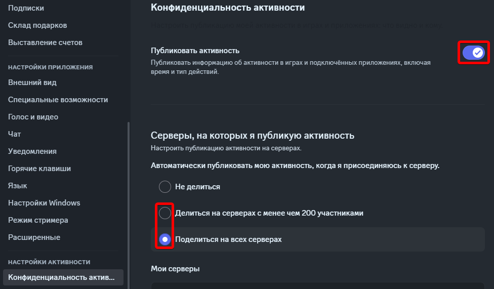

# 🛠️ Настройка

Если у вас возникли проблемы, проверьте [FAQ](faq.md).

Перед тем, как начать настройку, убедитесь, что вы используете клиент Discord (**не в браузере**), а так же что публикация активности включена в настройках Discord:

<figure><figcaption></figcaption></figure>

Если было выбрано "Не делиться" в настройках серверов, не забудьте выбрать на каких серверах делиться статусом в списке "Мои серверы".

## Процесс настройки

* Нажмите на кнопку **Подключить** для проверки соединения. В вашем статусе в дискорде должно появиться "Играет в **CustomRP**". В случае ошибок - проверьте [FAQ](faq.md). Вы можете опционально отключиться после проверки.
  * Статус не будет отображаться, если вы в режиме невидимки.
  * Если у вас установлен пользовательский статус (тот, где можно выбрать эмодзи), он будет отображаться вместо "Играет в...". Статус CustomRP будет виден в профиле и мини-профиле.
* Теперь вы можете заполнить остальные поля (все они необязательные, кроме Type и Display):
  * **ID**: Нужно только в случае, если вы хотите загрузить изображения как ассет (см. [расширенные настройки](#расширенные-настройки)).
    * Это поле можно изменить только если вы не подключены!
  * **Type**: Тип активности.
    * При выборе любого типа, кроме "Играет", поле Party становится недоступно. При типе "Соревнуется" становится недоступным поле Timestamp.
  * **Display**: Определяет, какое поле отображается в тексте статуса в списках пользователей.
  * **Name**: Название активности.
    * Если не задан ID, название по умолчанию - CustomRP, если задан - имя, которое вы дали приложению на портале.
  * **Details**: Первая строка в статусе под названием приложения.
    * **URL**: Ссылка, которая откроется при нажатии на текст поля Details.
  * **State**: Вторая строка в статусе. Или первая, если Details не заполнено.
    * **URL**: Ссылка, которая откроется при нажатии на текст поля State.
  * **Party**: Показывается как `(X из Y)` после строки State.
  * **Timestamp**: Таймер, показывающий время от и/или до определённой точки. Показывается под Details и State как `(чч:)мм:сс`.
    * Если установить начальные и конечные временные метки, а так же установить тип статуса "Слушает" или "Смотрит", вместо обычного таймера будет отображаться строка прогресса.
  * **Большое и маленькое изображения**: Изображения, показываемые слева от статуса. Если присутствуют оба, маленькое располагается в правом нижнем углу большого. Если установлено только маленькое, то оно будет отображаться как большое, но само изображение будет круглым, а не закруглённым прямоугольником.
    * **Key**: Если ваше изображение уже загружено в интернете, то вставьте в поле **прямую ссылку** (можно получить, нажав правой кнопкой по изображению и выбрать что-то типа "Скопировать ссылку на изображение"). Если ваше изображение на компьютере, воспользуйтесь любым хостингом для изображений (Imgur, ImageShack, и т.д.). **Не рекомендую** использовать ссылки на изображения, отправленные в самом Discord, так как ссылки очень длинные, и действуют только две недели.
      * Если приложение зависает на шаге "Обновление статуса...", вероятнее всего ссылка на изображение слишком длинная или не является прямой. Если вы уверены, что ссылка прямая - используйте сокращатель ссылок.
    * **Text**: Текст, показываемый при наведении (долгом зажатии на телефоне) на изображение.
    * **URL**: Ссылка, которая открывается при нажатии на изображение.
  * **Кнопки**: ⚠ Пожалуйста заметьте, что в данный момент в Discord присутствует баг - свои кнопки не видно, но другие их будут видеть.
    * **Text**: Текст, показываемый на кнопке.
    * **URL**: Ссылка, открываемая при нажатии на кнопку.
* Нажмите **Обновить статус** (или **Подключить**, если вы отключились).
* Поздравляем, вы прекрасны!

### Расширенные настройки

Если вы хотите загрузить свои изображения на портал разработчков как ассеты, или по каким-то причинам вам нужен свой ID приложения, выполните следующее:

* Перейдите на [портал разработчиков Discord](https://discord.com/developers/applications).
* Нажмите **New Application** в правой верхней части страницы.

* Выберите имя для приложения, именно оно будет отображено после слов "Играет в" в статусе; нажмите **Create**.
* Скопируйте **Application ID** и вставьте в поле **ID** в приложении.

* Чтобы загрузить изображения как ассеты: на странице приложения перейдите в Rich Presence -> Art Assets и загрузите хотя бы одно изображение в разделе Rich Presence Assets. В CustomRP есть пункт меню **Загрузить изображения** в меню **Файл** (доступный так же по нажатию Ctrl+U), который перенесёт вас на ту же страницу, если в программе заполнено поле ID.
  * Заметка 1: Обычно изображения становятся доступны для использования практически сразу же, но иногда на это может потребоваться несколько часов.
  * Заметка 2: Пожалуйста, не давайте названия ассетам длиннее 256 символов, так как это лимит в приложении.
* Если вы загрузите иконку приложения (App Icon на странице General Information), она будет использоваться как большое изображение в случае, когда в CustomRP оно не установлено. Это так же делает невозможным установку круглого изображения.

### Я использую два и больше клиента Discord, что мне делать?

Если у вас два и больше клиента, и статус показывается не в том аккаунте, в котором вы хотели бы, нажмите кнопку **Отключить**, затем зажмите кнопки Ctrl+Shift на клавиатуре и нажмите **Подключить**. Появится окошко с полем ввода, введите/выберите цифру 1, закройте окошко, и снова нажмите **Подключить** не нажимая Ctrl+Shift. В случае, если статус снова показывается не в том аккаунте, попробуйте ввести числа 0, 2 и далее до 9.

Обратите внимание, что если у вас несколько клиентов в автозагрузке, то от загрузки к загрузке у клиентов могут меняться значения pipe в зависимости от того, какой клиент запустится первым. Чтобы это предотвратить, или запускайте дополнительные клиенты вручную, или используйте Планировщик задач Windows, чтобы отложить запуск остальных клиентов.

Если вы одновременно используете 2 аккаунта и хотите иметь разные статусы на каждом из них, следуйте этой инструкции:

* Настройте CustomRP для первого аккаунта по инструкции выше.
* Скачайте последнюю **портативную (.zip)** версию CustomRP (или с [сайта](https://www.customrp.xyz), или со [страницы на GitHub](https://github.com/maximmax42/Discord-CustomRP/releases/latest)) и распакуйте архив в любое место.
  * Это работает только с версиями 1.16 и далее.
* Запустите `Start Second Instance.bat` или создайте ярлык для CustomRP.exe с аргументом `--second-instance` (или `-2`).
* Настройте программу так же, как вы настраивали её для первого аккаунта.
  * Подсказка: Если у вас уже есть готовый пресет, который вы хотите использовать для второго аккаунта, измените bat-файл или ярлык, добавив туда путь до пресета. Например:: `CustomRP.exe -2 "C:\Какая-то папка\preset.crp"` (кавычки обязательны, если в пути есть пробелы).
* Перед подключением измените значение pipe как показано ранее и подключитесь.

Если вы используете 3 или более аккаунта одновременно, то... зачем? А так же если достаточное количество пользователей этого попросит, я добавлю поддержку для большего количества экземпляров приложения.

## Заметки

* Если вы не хотите устанавливать изображения, оставьте все поля для них пустыми.
