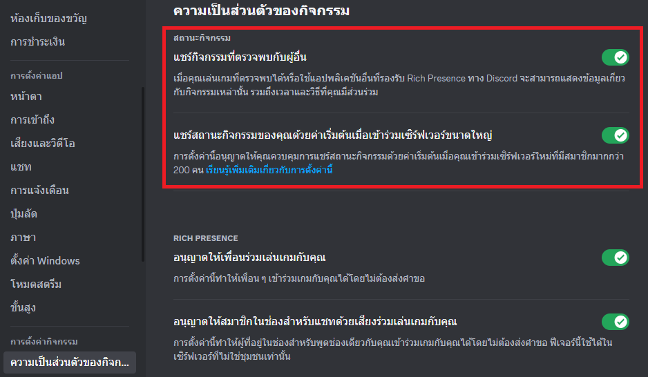

# 🛠️ ตั้งค่าการใช้งาน

ถ้าคุณเจอปัญหาอะไรก็ตาม, เช็กที่ [คำถามที่พบบ่อย](faq.md).

ก่อนที่จะเริ่มตั้งค่าเช็กให้แน่ใจว่าคุณมี Discord แค่อันเดียวที่เปิดอยู่ (**ไม่ใช่ในเบราว์เซอร์**)
และ เปิด "สถานะกิจกรรม" ในการตั้งค่าของ Discord แล้ว:

## ขั้นตอนเริ่มต้น

* เข้าเว็ป [Discord Developer portal](https://discord.com/developers/applications).
* กด **New Application** ทางด้านขวาบน.

* ใส่ชื่อที่จะต้องการให้โชว์, ชื่อจะโชว์ข้างล่างสถานะ "กำลังเล่น". กด **Create**.
* กดคัดลอก **Application ID** และ วางในฟิล์ด **ID**, แล้วก็กด **เชื่อมต่อ**.&#x20;

* ถ้าทำถูกต้อง, สถานะใน Discord ควรขึ้นว่า "กำลังเล่นเกม **\[ตามด้วยชื่อที่ใส่ตอนแรก]**". ถ้าเจอปัญหา, เช็กที่ [คำถามที่พบบ่อย](faq.md).
  * สถานะจะไม่โชว์ถ้าอยู่ใน โหมดไม่ระบุ. 
  * ถ้าคุณมีสถานะที่กำหนดเองอยู่แล้ว(อันที่ตั้งอีโมจิได้), มันจะเป็นอันแรกที่ถูกโชว์ แทนที่จะเป็น CustomRP. สถานะของ Custom RP ยังสามารถเช็คได้ในโปรไฟล์ถ้ามีสถานะที่กำหนดเองอยู่แล้ว.
* ถึงขั้นตอนนี้คุณสามารถกรอกฟิล์ดอื่นได้แล้ว (สามารถกรอกอะไรก็ได้ตามที่คุณต้องการ):
  * **Details**: บรรทัดแรกที่จะโชว์ในสถานะ ข้างล่างชื่อที่ใส่ใน Application.
  * **State**: บรรทัดสองที่จะโชว์ในสถานะ. จะกลายเป็นบรรทัดแรกถ้า Details ไม่ได้กรอกอะไร.
  * **Party**: โชว์ตัวเลข `(X of Y)` ข้างหลังบรรทัด State. ถ้า Party ไม่ได้ใส่อะไร, Party จะไม่โชว์ขึ้นมา.
  * **Timestamp**: ตัวจับเวลาที่จะนับตามรูปแบบ Timestamp ที่เลือก. จะโชว์เวลาข้างล่าง Details และ State" `xx:xx:xx ผ่านไป` หรือ `xx:xx:xx เหลืออยู่`. สามารถโชว์เวลาถึงแค่ `23:59:59` ก่อนที่จะเริ่มนับใหม่ที่ `00:00`.
  * **ภาพขนาดใหญ่ และ เล็ก**: เป็นรูปภาพที่จะโชว์ทางด้านซ้ายของสถานะ. ถ้าทั้งสองภาพถูกตั้งค่าให้โชว์, ภาพเล็กจะย่อขนาดอยู่ด้านขวาล่างของภาพใหญ่.
    * **Key**: จะเป็นช่องกรอก URL ที่ใช้ให้รูปภาพโชว์ (แนะนำ, เนื่องจากคุณสามารถใช้ GIFs ได้ด้วย) หรือ จะเป็นชื่อ Asset ภาพที่จะใช้ก็ได้.

      * _ถ้าเลือกใช้ URL:_ ถ้ารูปภาพที่จะใช้อยู่ในอินเตอร์เน็ตแล้ว, วาง **ลิ้งค์โดยตรง** ในฟิล์ด
      (โดยปกติคัดลอกลิ้งค์โดยตรง โดย กดคลิกขวา และ เลือก "คัดลอกลิ้งค์รูปภาพ"). ถ้ารูปภาพของคุณอยู่ในคอมพิวเตอร์ยังไม่ได้อัปโหลดไปที่อินเตอร์เน็ต, ให้ใช้เว็ปไซต์ที่สามารถอัปโหลดไฟล์รูปภาพได้ เช่น (Imgur, ImageShack, อื่น ๆ). ไม่ **แนะนำ** ให้ใช้ภาพที่อัปโหลดใน Discord หรือ ช่อง Discord, ลิ้งค์ของรูปภาพจะหมดอายุใน 2 สัปดาห์.
        * ถ้าการเชื่อมต่อค้างที่ "กำลังอัพเดทสถานะ...", อาจจะเป็นเพราะว่า URL ที่กรอกในฟิล์ดนั้นยาวเกินไป หรือ มันไม่ใช่ลิ้งค์โดยตรง. ถ้าคุณแน่ใจว่าเป็นลิ้งค์โดยตรงแน่นอน, ให้ใช้ URL Shortner หรือ ย่อ URL.
      * _ถ้าเลือกใช้ Art Asset:_ ที่หน้าเว็ปของที่ตั้งชื่อ application ตอนแรก กดเข้าไปที่ application ที่ตั้ง,เลือก Rich Presence ตามด้วย Art Assets และ อัปโหลดสัก 1 รูปภาพข้างล่าง Rich Presence Assets. ใน CustomRP, ให้มองหา **อัปโหลด Assets** ใน หน้าต่างไฟล์ (สามารถกด Ctrl+U แทนได้) หลังจากกดจะเปิดหน้าเว็ปให้อัปโหลดรูปภาพ(ถ้าช่อง ID กรอกแล้ว) ทำตามขั้นตอนข้างบน.
        * โน้ต 1: แม้ว่าโดยปกติแล้วภาพจะสามารถใช้งานได้ทันที, แต่ในบางกรณีอาจจะต้องรอหลายชั่วโมงถึงจะใช้งานได้.
        * โน้ต 2: คุณสามารถตั้งชื่อ Asset ได้มากกว่า 999 ตัวอักษร,แต่แอปจะซัพพอร์ตแค่ 256 ตัวอักษรเท่านั้น.
    * **Text**: ตัวหนังสือที่จะโชว์ขึ้นเมื่อเอาเคอร์เซอร์เม้าส์ ไปชี้ที่รูปภาพ (หรือ กดค้างที่ภาพ ถ้าเป็นมือถือ).
  * **Buttons**:
    * **Text**: ข้อความของปุ่มที่จะตั้ง.
    * **URL**: ลิ้งค์ URL ที่จะใช้สำหรับเปิดหน้าเว็ป เมื่อกดคลิกที่ปุ่ม.
* กด **อัพเดทสถานะ** (หรือ **เชื่อมต่อ** ถ้ายังไม่ได้เชื่อมต่อ).
* ยินดีด้วย, ทำได้ดีหนิ!

### ฉันใช้ Discord มากกว่า 1 ไคลเอนต์, ควรทำยังไง?

ถ้าคุณมี Discord มากกว่า 1 ไคลเอนต์, และคุณอยากให้สถานะโชว์ต่างกันในแต่ละบัญชี Discord จากอันที่กรอกในแอปไปแล้ว, กด **ยกเลิกการเชื่อมต่อ**, ตามด้วย กด Ctrl+Shift ค้างไว้ แล้วค่อยกด **เชื่อมต่อ**. หน้าต่างที่มีตัวเลขให้ใส่จะโผล่ขึ้นมา, ให้ใส่ตัวเลข 1, ปิดหน้าต่างนั้น. และกด **เชื่อมต่อ** อีกครั้ง, ไม่ต้องกด Ctrl+Shift.ถ้าในกรณีที่ยังไม่ขึ้นในบัญชีที่ต้องการ, ลองตัวเลขเป็น 0,แล้วก็ 2 จนถึง 9 (ใส่ทีละเลขไม่ใช่ใส่ทีเดียว)

โปรดทราบว่าหากคุณมี Discord หลายตัวที่ทำงานเมื่อเริ่มต้น หมายเลข Pipe ที่กำหนดให้กับไคลเอนต์แต่ละตัวอาจจะไม่ได้ใช้ตัวเลขเดิมตั้งแต่เปิดเครื่อง และสามารถเปลี่ยนแปลงได้ขึ้นอยู่กับไคลเอนต์ตัวใดที่เริ่มทำงานก่อน เพื่อป้องกันไม่ให้เกิดเหตุการณ์ดังกล่าว สามารถเริ่มไคลเอนต์เพิ่มเติมด้วยตนเอง หรือใช้ Windows Task Scheduler เพื่อชะลอการเริ่มต้นไคลเอนต์

ถ้าคุณมี 2 บัญชีที่ใช้พร้อมกันและอยากให้ทั้ง 2 มีสถานะที่ต่างกัน, ทำตามขั้นตอนด้านล่าง:

* ตั้งค่าบัญชีแรกอะไรให้เรียบร้อยตามวิธีด้านบน.
* ดาวน์โหลดเวอร์ชั่นล่าสุดของ CustomRP แบบ **portable (.zip)** (หรือเข้าได้ที่ [เว็ปไซต์](https://www.customrp.xyz) หรือ [GitHub releases page](https://github.com/maximmax42/Discord-CustomRP/releases/latest)) และแตกไฟล์ที่ไว้โฟลเดอร์ที่ต้องการ.
  * วิธีนี้ได้ผลเฉพาะ เวอร์ชั่น 1.16 หรือ สูงกว่านั้น.
* เปิดไฟล์ `Start Second Instance.bat` หรือสร้างทางลัดไปยังไฟล์ CustomRP.exe โดยมีอาร์กิวเมนต์ `--second-instance` (หรือ `-2`) 
* ตั้งค่าโปรแกรมเหมือนกับที่ทำกับอินสแตนซ์หลักของคุณ.
  * เคล็ดลับ: หากคุณมีพรีเซ็ตที่ต้องการใช้กับอินสแตนซ์ที่สอง คุณสามารถแก้ไขไฟล์ bat หรือ Shortcut เพื่อรวมเส้นทางไปยังพรีเซ็ตได้ ตัวอย่าง: `CustomRP.exe -2 "C:\Some Folder\preset.crp"` (จำเป็นต้องใช้อัญประกาศ รอบๆ เส้นทางโฟลเดอร์ หากเส้นทางมีช่องว่าง).
* ก่อนที่จะเชื่อมต่อ ให้เปลี่ยนค่า Pipe ตามที่อธิบายไว้ก่อนหน้านี้แล้วเชื่อมต่อ

ถ้าคุณใช้มากกว่า 3 บัญชีพร้อมกัน, ทำไป...ทำไม? ถ้ามันอาจจะทำให้คุณบ่นฉัน, ฉันอาจจะเพิ่มการซัพพอร์ตสำหรับหลายบัญชีมากขึ้น.

## โน้ต

* ถ้าไม่ต้องการที่จะเพิ่มรูปภาพใหญ่กับเล็ก, ไม่ต้องกรอก URL สามารถให้ปล่อยว่างได้.
* ถ้าภาพใหญ่ไม่ได้ถูกใช้, ภาพเล็กจะไม่โชว์.